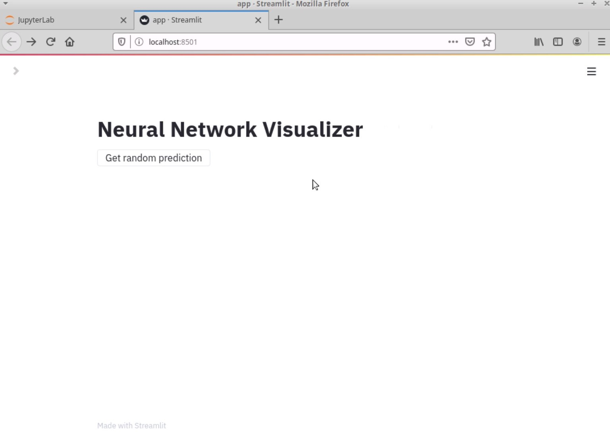
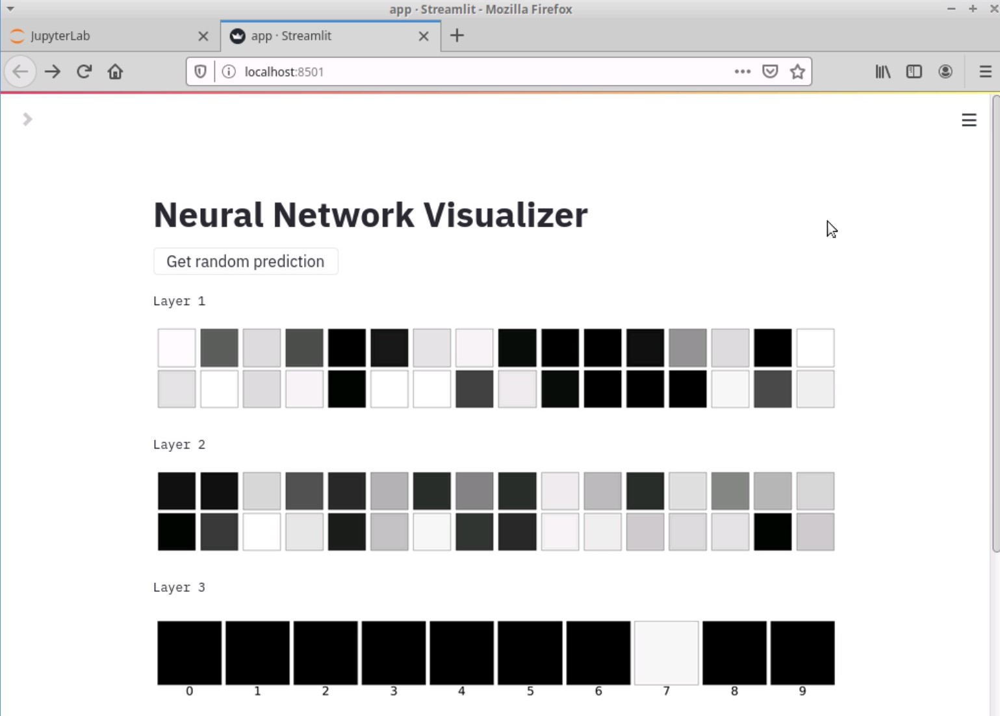
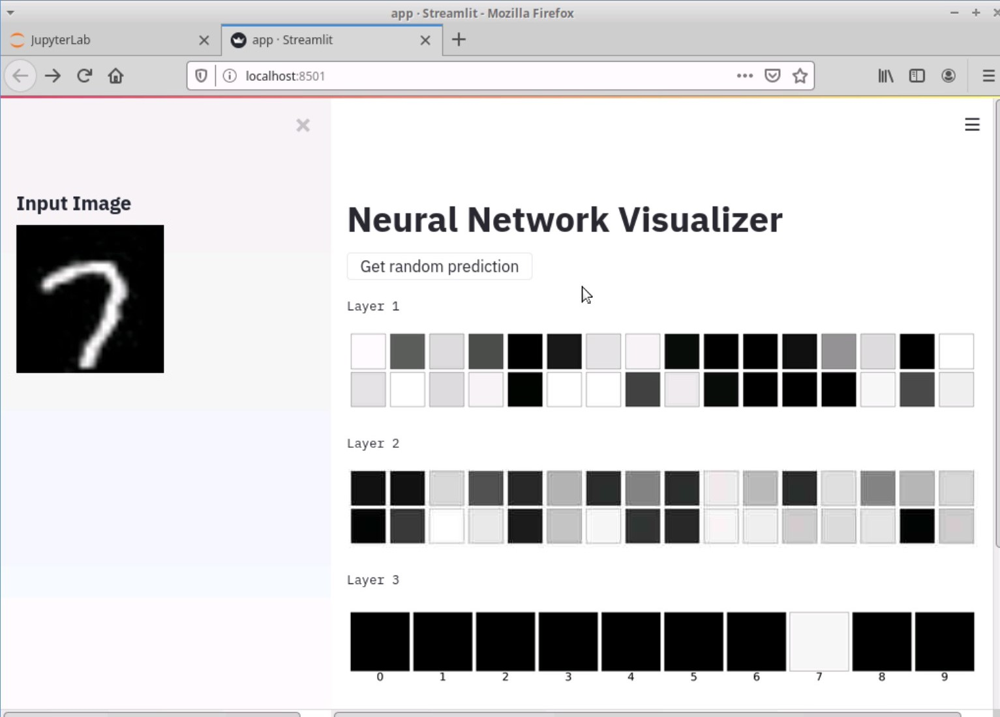
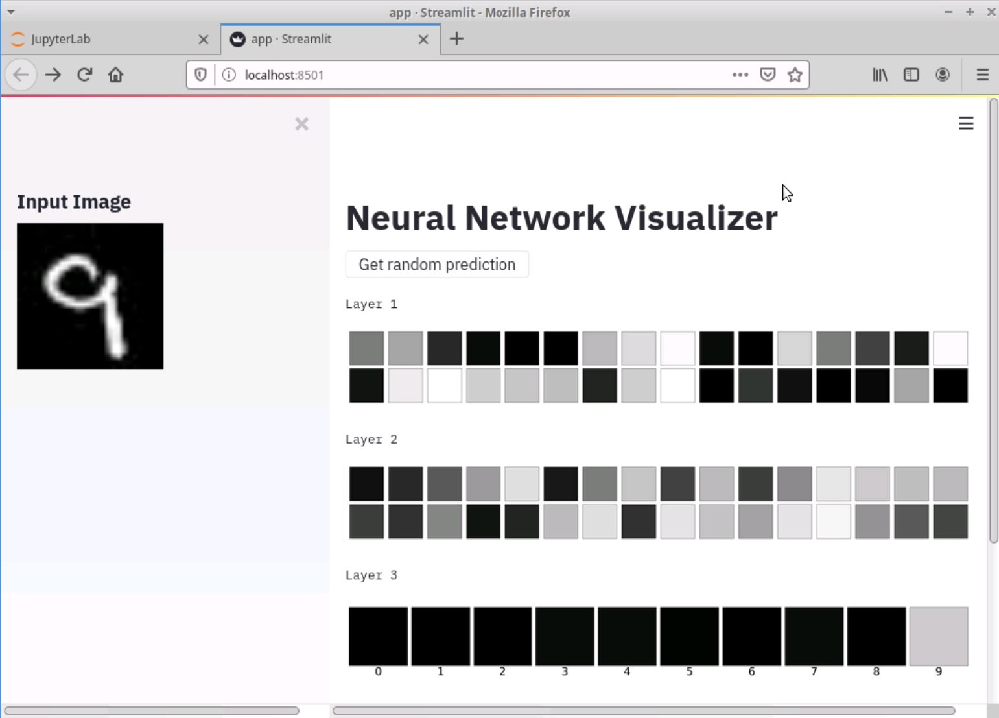

# Neural Network Visualizer

A web application that provides real-time visualization of neural network predictions for MNIST digits, built with Keras, Flask, and Streamlit. This project demonstrates the internal representations learned by a neural network through an interactive interface.

## 🎯 Features

- **Real-time Visualization**: Interactive visualization of neural network layer activations
- **Random Sampling**: Automatic sampling from MNIST test dataset
- **Layer-wise Analysis**: Visual representation of activations at each network layer
- **Distributed Architecture**: Separate model server and web interface
- **Interactive UI**: Clean, responsive interface built with Streamlit
- **REST API**: Flask-based API for model predictions

## 🛠️ Technical Architecture

### Components
- **Neural Network**: 3-layer architecture built with Keras
  - Input Layer: 784 neurons (28x28 flattened images)
  - Hidden Layer 1: 32 neurons with sigmoid activation
  - Hidden Layer 2: 32 neurons with sigmoid activation
  - Output Layer: 10 neurons with softmax activation

- **Model Server**: Flask-based REST API
  - Loads trained model
  - Handles prediction requests
  - Serves layer activation data

- **Web Interface**: Streamlit application
  - Displays input images
  - Visualizes layer activations
  - Provides interactive controls

## 📋 Installation

1. Clone the repository
```bash
git clone https://github.com/yourusername/neural-network-visualizer.git
cd neural-network-visualizer
```

2. Install dependencies
```bash
pip install tensorflow flask streamlit numpy matplotlib
```

3. Train the model (optional - pre-trained model included)
```bash
jupyter notebook model_training.ipynb
```

4. Start the model server
```bash
python ml_server.py
```

5. Launch the web application
```bash
streamlit run app.py
```

## 🚀 Usage

1. Access the application at `http://localhost:8501`
2. Click "Get random prediction" to select a random MNIST digit
3. Observe the network's layer-wise activations:
   - Layer 1: 32 neurons' activation patterns
   - Layer 2: 32 neurons' activation patterns
   - Output Layer: 10 neurons' activation probabilities


## 📊 Visualization Examples

<table width="100%">
<tr>
<td width="50%"><strong>Initial View</strong></td>
<td width="50%"><strong>Prediction Visualization</strong></td>
</tr>
<tr>
<td></td>
<td></td>
</tr>
<tr>
<td><strong>Input Image</strong></td>
<td><strong>Another Prediction</strong></td>
</tr>
<tr>
<td></td>
<td></td>
</tr>
</table>


## 📁 Project Structure
```
neural-network-visualizer/
├── app.py                 # Streamlit web application
├── ml_server.py           # Flask model server
├── model_training.ipynb   # Model training notebook
├── demo/                  # Application screenshots
└── README.md              # Documentation
```

## 🔧 Technical Details

### Model Architecture
- Input Shape: (784,) - Flattened 28x28 MNIST images
- Hidden Layers: 2x32 neurons with sigmoid activation
- Output Layer: 10 neurons with softmax activation
- Loss Function: Sparse Categorical Crossentropy
- Optimizer: Adam
- Metrics: Accuracy

### API Endpoints
- POST `/`: Returns predictions and layer activations
- GET `/`: Server health check

## 🔬 Implementation Details

1. **Data Preprocessing**
   - MNIST digits normalized to [0,1] range
   - Images flattened to 784-dimensional vectors

2. **Model Server**
   - Loads pre-trained model
   - Extracts intermediate layer outputs
   - Serves predictions via REST API

3. **Visualization**
   - Layer 1 & 2: 16x2 grid of neuron activations
   - Output Layer: 1x10 grid of class probabilities
   - Color intensity indicates activation strength

## 🤝 Contributing

1. Fork the repository
2. Create a feature branch (`git checkout -b feature/improvement`)
3. Commit changes (`git commit -am 'Add new visualization'`)
4. Push to branch (`git push origin feature/improvement`)
5. Create a Pull Request

## 📄 License

This project is licensed under the MIT License - see [LICENSE.txt](LICENSE.txt) for details.

## 📚 References

- [TensorFlow Documentation](https://www.tensorflow.org/)
- [Streamlit Documentation](https://docs.streamlit.io/)
- [Flask Documentation](https://flask.palletsprojects.com/)
- [MNIST Dataset](http://yann.lecun.com/exdb/mnist/)

## 📞 Contact

For questions and feedback, please open an issue in the repository.
